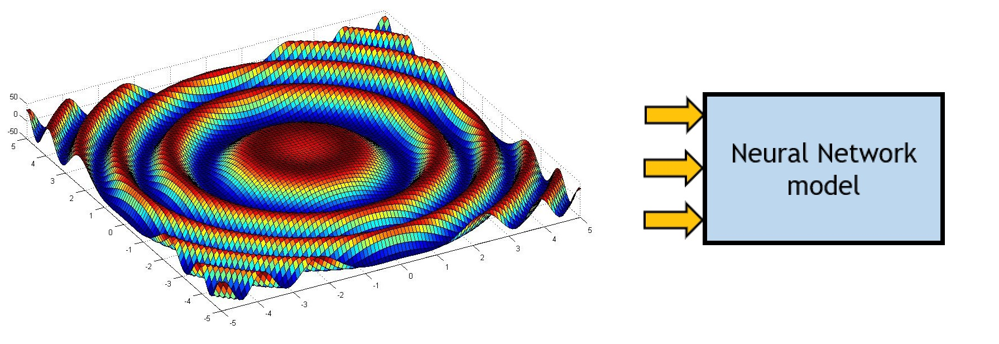
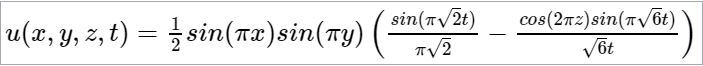

```{r setup, include=FALSE}
knitr::opts_chunk$set(echo = TRUE)
```


     
## Project details
This project is based on the article [“Distributed Parameter System Identification using Finite-Element Differential Neural Networks”](https://www.sciencedirect.com/science/article/abs/pii/S1568494616000119). The main purpose is to replicate the second experiment of the previously mentioned article. It consists on perform the [System Identification](https://en.wikipedia.org/wiki/System_identification) of the [three-dimensional wave equation in a cube](https://books.google.com.ec/books?id=v9zeDwAAQBAJ&pg=PA162&dq=La+ecuación+de+ondas+tridimensional+en+un+cubo&hl=en&sa=X&ved=2ahUKEwiRiKyVuYPxAhUmMlkFHftEBL8Q6AEwAHoECAcQAg#v=onepage&q=La%20ecuación%20de%20ondas%20tridimensional%20en%20un%20cubo&f=false). The solution of the partial differential equation (PDE) is:

<!---
$u(x,y,z,t)=\frac{1}{2}sin(\pi x)sin(\pi y) \left( \frac{sin(\pi \sqrt{2}t)}{\pi \sqrt{2}}-\frac{cos(2\pi z)sin(\pi \sqrt{6}t)}{\sqrt{6}t}\right)$
--->



The solutions of this equation (in each time step) were used to train the neural network as if they were measurements of a real system. It means that the FEDNN doesn’t need an explicit solution to the system.

The article uses a Differential Neural Network ([DNN](https://books.google.com.ec/books?id=YGFqDQAAQBAJ&printsec=frontcover&dq=differential+neural+networks&hl=en&sa=X&redir_esc=y#v=onepage&q=differential%20neural%20networks&f=false)) based on the Finite Element Method ([FEM](https://en.wikipedia.org/wiki/Finite_element_method#:~:text=The%20finite%20element%20method%20\(FEM,mass%20transport%2C%20and%20electromagnetic%20potential.)) structure to perform the identification of the “unknown” distributed parameter system. This system represents the propagation of sound waves, due to an initial perturbation, in a cubic room. The system domain is 0 < *x, y, z* < 1.

### Methodology


1. Create the mesh of elements and nodes of the FEM. For the current system, the entire cube (the problem domain) is subdivided into 1000 nodes and 4374 tetrahedral elements (9\*9\*9 cubes and 6 tetrahedral per cube, as in the image below)


2. Assemble the element arrays in the stiffness matrix (*Kmask*)
3. Initialize the parameters corresponding to the DNN: 
  * *W1* is the weight matrix of the input layer of the DNN
  * *V1* is the weight matrix of the hidden layers of the DNN state of the system
  * *h* is the sample pe
  * *us* is the first measured data
  * *u* is the initialriod (0.01 seconds) 
  * *𝑃, 𝐴, 𝐷𝜎, 𝐾1, 𝐾2,𝑉0,𝑙,* and *Λ* are constants of the learning rulers
4. In order to train the neural network according the article, *W1* and *V1* are masked with *Kmask*  
5. Solve the Differential Equations of the DNN using the Runge-Kutta 4th Order Method ([RK4](https://en.wikipedia.org/wiki/Runge–Kutta_methods)), with *h* as step-size, to update *W1* and *V1*
6. Take again a new sample of the system and update the *us* variable
7. Repeat steps 4, 5, and 6 until the simulation time (*ts*)
     
## Results
The [contour plot](https://la.mathworks.com/help/matlab/ref/contourf.html?searchHighlight=contourf&s_tid=srchtitle) of the measured system (solutions of the PDE) and the contour plot of the FEDNN model are compared to evaluate the performance of the Neural Network. These contour plots correspond to the plane x=y in the cubic domain. Also, the Mean squared Error ([MSE](https://en.wikipedia.org/wiki/Mean_squared_error)) is calculated using the solution to the system at the coordinates (x=0,5; y=0,5; z=0,5) and the corresponding FEM-based DNN approximation.


## Analysis of results

Some conclusions after training the FEDNN are:

* Using more elements with the same number of nodes makes the system more accurate.
* The delay in the approximate system, concerning the “real”, depends on the values of matrix A.
* The system may become unstable (with current parameters) in a long simulation time.

